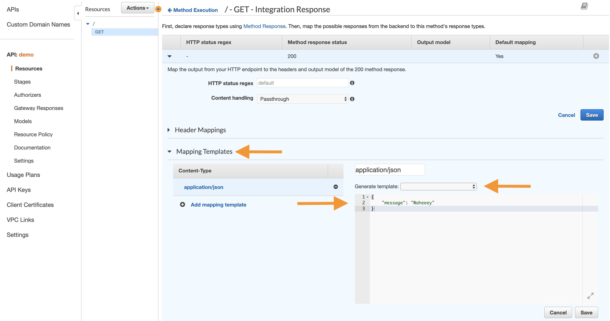
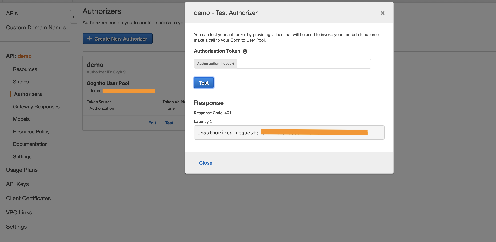

# AWS's Serverless Bouncer: A Step by Step Guide to Implementing API Gateway Secured With Cognito

***Disclaimer:*** *The aim of this short post is to explain the basic steps of securing a mock API using API Gateway with Cognito as the 'authorizer'. This is not a full guide to either of these AWS services and the benefits / drawbacks they can bring to your architecture. Further research and practice will be required. This only focuses on the security use case.*

## AWS’s Definitions of API Gateway and Cognito

**Amazon API Gateway**: ‘An AWS service for creating, publishing, maintaining, monitoring, and securing REST and WebSocket APIs at any scale’. We will be focusing on the API Gateway REST API which ‘is made up of resources and methods. A resource is a logical entity that an app can access through a resource path. A method corresponds to a REST API request that is submitted by the user of your API and the response returned to the user’.

**Cognito**: ‘Provides authentication, authorization, and user management for your web and mobile apps. Your users can sign in directly with a user name and password, or through a third party such as Facebook, Amazon, Google or Apple’. This has two main aspects: User pools and Identity pools. We will be focusing on User pools which are ‘user directories that provide sign-up and sign-in options for your app users’.

## Why Integrate These Services Into Your Architecture?

An easy way to think of API Gateway is as a bouncer - it allows or prevents entry to the API. We are integrating Cognito to be the brains behind this decision.

It is more than possible to build your own security layer, but for the price and speed of development this is a very simple and relatively secure solution. For basic security concerns it is it is a great start and a layer that is often recommended. I would, however, recommend that you still have an authentication check and authorisation layer within each of your APIs.

These services integrate with each other with ease, as AWS API Gateway provides built-in support for AWS Cognito OAuth2 scopes through its 'Authorizer' function  (we will look at this in more detail later). You simply need to set up a Cognito user pool to be referenced in the API Gateway.

API Gateway is not only useful when it comes to security matters. API Gateway becomes a single, unified entry point to the micro-services behind it. This reduces the complexities of your micro-services as the Gateway can look after aspects such as the API life cycle management, API tokens, caching, monitoring, throttling (also used for security against ddos attacks), and many more. This allows each micro-service to focus on what it is built to do.

We are focusing on the security aspects in this walkthrough but we will touch on the ability modify the JSON schema during the request and response cycles. This message transformation is a very useful aspect of API Gateway as it allows the client to send all requests in a standardised format increasing UX. The API Gateway can then transform the request message into the specific format the micro-service understands, and transform the response back again. Both the requester (client) and the provider (target endpoint) are only aware of the proxy (API Gateway).


## Tutorial

In the tutorial below we will use a ‘mock integration’, meaning we won’t have a real target endpoint to use as feedback, but will mock the response.

At the end you should have a basic foundation to then go and deep dive into the two services and connect your API as the target endpoint. You can even try to use a fully serverless architecture and write your API using lambda functions.

***Pre-requisites:*** *You should have set up an AWS account and have postman downloaded. We will be using services which are not free, but if you take them down after you should not be charged.*

There are 6 steps leading up to this stage:

1. Set up the Cognito user pool
2. Set up the API Gateway
3. Create an 'authorizer' within API Gateway
4. Use postman to retrieve a token from Cognito
5. Apply the 'authorizer' to your created API method
6. Return back to postman, and test it out

__________
### 1. Set up the Cognito user pool:

a. Go to your AWS Management console and then navigate to the Cognito service. Select ‘Manage your user pools’ followed by ‘Create a user pool’


b. Enter a pool name and select ‘Review defaults’

c. This will give you an overview of the more detailed settings to Cognito, such as what attributes you wish to be stored in the id_token (there is a selection to choose from and/or you can add custom attributes), policies, verifications, advanced security and more. This is slightly out of the scope for this tutorial but something to investigate if you are going to implement this fully into an application. Once you have reviewed these, click ‘Create pool’.


d. Create an app client. To do this navigate to ‘General Settings > App clients’ and select ‘Add an app client’.

e.	Enter an ‘App client name’ and make sure you have checked the ‘Generate client secret’ checkbox


f.	Then click ‘Create app client’ and make a note of the App client id and secret which are displayed. We will need to use the 'App client id' later.

g. Navigate to ‘Domain name’ and create your own domain, check it is available and save changes


<ol> i) If you use the domain name demo-url (and created in eu-west-2) then the URL would be: https://demo-url.auth.eu-west-2.amazoncognito.com </ol>

h. Open the ‘App client settings’ and you will see the Enabled Identity providers' for the new app. Select ‘Cognito User pool’.


i. At this point, to proceed, we need a call-back and sign out URL. Use something such as https://google.co.uk (just ensure it's https not http)

j. Under Allowed OAuth flows check the implicit grant checkbox

k. Under Allowed OAuth Scopes check the aws.cognito.signin.user.admin and open id checkboxes - the latter lets you receive the id token as well as an access token.

### 2. Set up the API Gateway

a. Navigate to API Gateway service


b. Select ‘Get started’ and then ‘Create API’

c. Fill in the form with:

<ol>
i. API name
<br>
ii. Description (can be blank)
<br>
iii. Select ‘Regional’ as the endpoint type
</ol>


d. Click on the / resource

e. Go to the ‘Actions’ drop down and select ‘Create Method’


f. Create the GET method for the root (under the / resource)


g. Set the Integration type to mock – as mentioned before this is so we can set up the Cognito authorisation without having to create a fully functioning API before hand


h. Click save and you will see the method execution dashboard. Here there are 4 quadrants, with the client and target endpoint represented on the left and right of the page respectively. Below explains the flow of information and where message transformation takes place:

<ol>
i. <b>The client</b> – this represents the browser which sends the request. By clicking test it simulates a 200 response.
<br>
ii. <b>Method request</b> – this is where the API Gateway receives the request from the client. This is the logical placement of the authoriser as there is no need to progress if the requester is not authorised - return 401.
<br>
iii. <b>Integration request</b> – this is the request being sent to the target endpoint. This is where you can transform the message modifying the method request as needed by the specific backend (in our case the target endpoint). In our mock example, we can set mapping templates to specify the responses (HTTP status codes and messages) which will be returned.
<br>
iv. <b>Target endpoint</b> – this represents the endpoint, whether it be a URL, a lambda function, etc. in our case it highlights that we don’t have a backend with the mock implementation.
<br>
v. <b>Integration response</b> – this is the response from the target endpoint, you can also configure responses if there is an arbitrary response, such as fixing / standardising error messages. In the mock example we are following, the response is set by the mapping templates in the integration request.
<br>
vi. <b>Method response</b> – this represents the HTTP status code that will be returned to the client. This is where the rest of the response is formulated including their headers, content type etc. It is also here where you transform the response as needed before sending it to the client.
</ol>


*Note: you can transform messages at all stages, however, it is best practice to use the stage before it hits the target endpoint (2nd quadrant) and the stage before it is returned to the client (4th quadrant).*


i. For this example, we only need to edit the Integration response – open the 200 response and go to mapping templates, click on application/json and use the method request passthrough template. This will ‘pass through all parameters including path, querystring, header, stage variables, and context through to the integration endpoint via the body/payload’. Or set the return message as a JSON such as:

```json
{
  "message": "Waheeey"
}
```



j. Save and return to the method

k. Click test on the client and you will see that you get a 200 with a response body (or Waheeey)


### 3. Create an authoriser within API Gateway

a. On the left menu in API Gateway, select the 'Authorizers' link

b. 'Create New Authorizer'

c. Set the name and select Cognito as the type, this will then let you pick your user pool


d. Token source needs to be: 'Authorization' and Token validation can be empty

### 4. Use postman to retrieve a token from Cognito

a. Open postman

b. Under a new request tab, look beneath the URL bar and select the 'Authorization' tab

c. Click the type dropdown and select OAuth 2.0

d. To the right of this an orange button will have appeared - 'Get New Access Token'


e. Click this and a form will popup:

<ol>
i. Fill in token name (can be anything)
<br>
ii. Grant type – select implicit
<br>
iii. Fill in call back URL with the URL you chose earlier (https://google.co.uk/)
<br>
iv. Fill in Auth URL with the domain you chose earlier (you will need to end this with /login to hit the correct endpoint)
<br>
v. Fill in Client id with the details you saved earlier for the app client, if you go back to the app client settings page in Cognito you will see it under the name of your client
<br>
vi. Click request token and you will be taken to a login page.
<br>
<br>


<br>
vii. If you have not got a user click sign up and proceed
<br>
viii. Go to your Cognito user pool and confirm the user, then repeat i-iv
<br>
ix. Login with the confirmed credentials
<br>
x. This will return you the token name, access token, type of code (bearer), id token and expires in value

</ol>

f. Copy the id token and return to your 'Authorizers' screen in API Gateway service in the AWS management console

g. Click test under the 'Authorizer' you created

<ol>
i. use the token to send a request and see a 200 status along with information about the user
<br>
<br>


ii.	Enter a random code in and see 401 unauthorised



</ol>

### 5.	Apply the 'Authorizer' to your created API method

a. We have created an 'Authorizer' that is linked to Cognito, this can be applied to any of the methods which you chose

b. If you return to your resources, click on the previously created GET method and go to the method request

c. Set the 'Authorization' to be the 'Authorizer' you have created


d. Click the ‘Actions’ dropdown and select ‘Deploy API’

<ol>
i. Create a new stage and name it etc.

</ol>

e. Once deployed you have a URL to test against - click it and see a unauthorised message showing that the bouncer is not letting you in (probs telling you to come back in 20 mins and try again but we all know that never works)


### 6. Return back to postman, and test it out

a. Copy the id token and paste it where it says access token next to the orange button which originally took you to the form (this is confusing but it is the id token we need and not the access token)

<ol>
i. This will set the 'Authorization' header to this token along with the type
</ol>

b. Fill the URL bar with the URL you have now got from the API Gateway and set it to a GET request at the root level (this is the method and resource we created in the API Gateway)

c. Send your request and see a 200 status with the request body


d. Now remove the token and send it again to see a message saying unauthorised


You have now set up your first authorised route through API Gateway secured by Cognito

## Possible Next Steps
* Create other resources and methods
* Add conditionals to your API Gateway and return responses other than the 200 we defined
* Have a deep dive into the various settings we have glossed over in Cognito and the other integration types
* Use your own API rather than using the mocking function
  * A good starting point is to take a very basic API deploy it on elastic beanstalk
    * This is a platform designed by AWS for devs, it removes the deployment and management aspects
    * This will assign you a URL to use as your API endpoint
* Try out a completely serverless architecture and write the API with lambda functions
